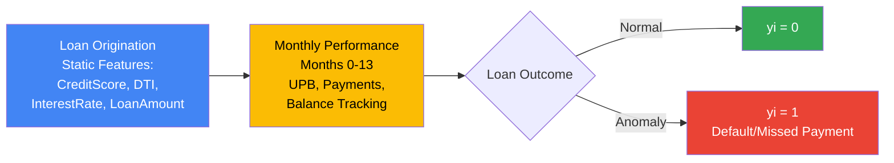
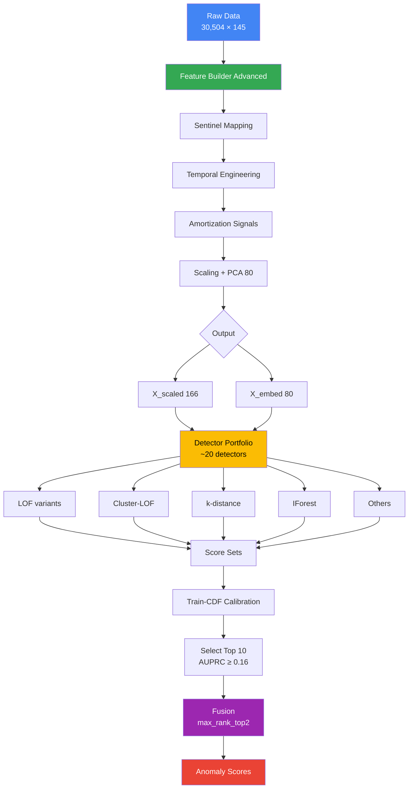
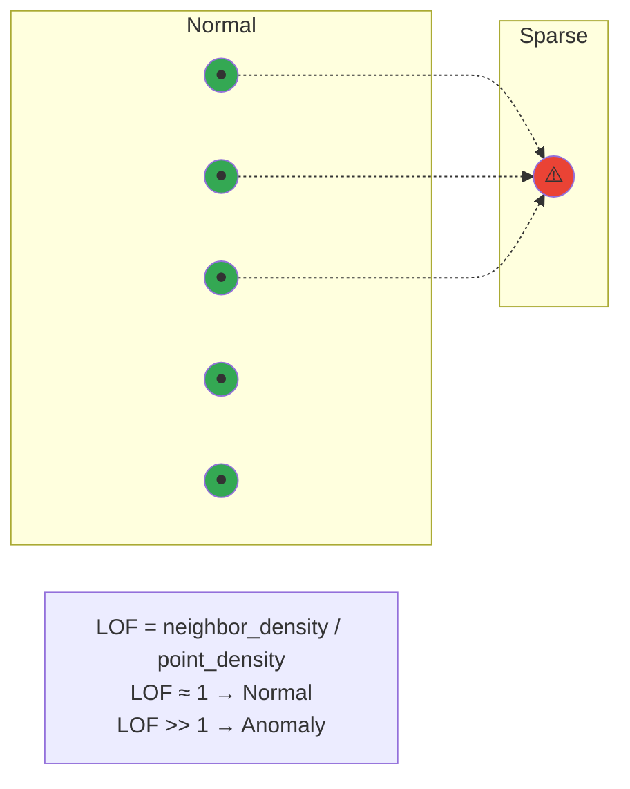

# Diagrams We Need to Create (Don't Have PNG For)

## DIAGRAM 1: Loan Lifecycle (Slide 2)

---

## DIAGRAM 2: Final Model Architecture (Slide 21)

---

## DIAGRAM 3: LOF Intuition (Slide 13)

---

## How to Use:

1. Go to https://mermaid.live
2. Paste each code block
3. Export as PNG or SVG
4. Insert into Google Slides

That's it. Done. 3 diagrams total.
